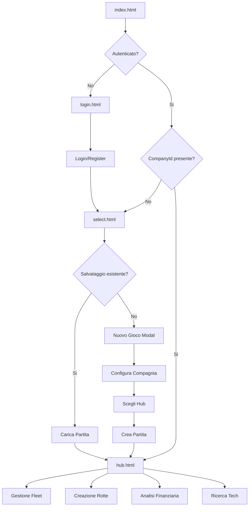
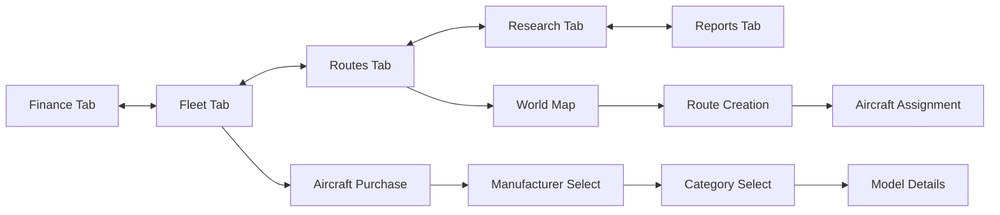

# Air Tycoon 2 - Mappa Funzionale delle Pagine

## 📋 Indice

1. [Panoramica Generale](#panoramica-generale)
2. [Pagina Index (Launcher)](#pagina-index-launcher)
3. [Sistema Autenticazione](#sistema-autenticazione)
4. [Selezione Gioco](#selezione-gioco)
5. [Hub Principale (Gioco)](#hub-principale-gioco)
6. [Modali e Sottosistemi](#modali-e-sottosistemi)
7. [Flusso Utente](#flusso-utente)

---

## 🌍 Panoramica Generale

Air Tycoon 2 è strutturato come una **Single Page Application modulare** con routing client-side e caricamento dinamico dei contenuti.

### Architettura delle Pagine

```
index.html (Launcher)
├── /game/pages/auth/login.html (Autenticazione)
├── /game/game/select.html (Selezione Gioco)
└── /game/pages/hub.html (Hub Principale)
    ├── Tab Finance
    ├── Tab Fleet
    ├── Tab Routes
    ├── Tab Research
    ├── Tab Reports
    └── World Map (integrato)
```

---

## 🚀 Pagina Index (Launcher)

### **File**: `index.html`

### **Scopo**: Entry point dell'applicazione - decide dove indirizzare l'utente

#### Funzionalità:

- **Controllo Sessione**: Verifica se l'utente è autenticato
- **Routing Intelligente**: Redirige automaticamente alla pagina appropriata
- **Gestione CompanyId**: Recupera e valida l'ID della compagnia selezionata

#### Flusso Logico:

```javascript
1. Carica load-game.js
2. Controlla sessionStorage per companyId
3. SE autenticato E companyId valido → /game/pages/hub.html
4. SE autenticato MA no companyId → /game/game/select.html
5. SE non autenticato → /game/pages/auth/login.html
```

#### File Coinvolti:

- `Client/src/load-game.js` - Logica di routing e validazione
- `Client/src/utils/AuthManager.js` - Gestione autenticazione

---

## 🔐 Sistema Autenticazione

### **File**: `/game/pages/auth/login.html`

### **Scopo**: Gestione completa dell'autenticazione utente

#### Sezioni Principali:

##### 🔑 **Form di Login**

- **Elementi**: Email, Password, Bottone "Accedi"
- **Validazione**: Client-side + server-side
- **API**: `POST /api/auth/login`
- **Redirect**: → `/game/game/select.html` dopo login successo

##### 📝 **Form di Registrazione**

- **Elementi**: Email, Password, Conferma Password, Bottone "Registrati"
- **Validazione**: Password minimo 6 caratteri, conferma password
- **API**: `POST /api/auth/register`
- **Comportamento**: Switch dinamico con form login

##### 🎨 **UI/UX Features**:

- **Animazioni**: Sfondo con nuvole e aeroplano animati
- **Switch Forms**: Transizione fluida tra login e registrazione
- **Feedback**: Loading overlay + messaggi di successo/errore
- **Responsive**: Design adattivo mobile-first

#### File Coinvolti:

- `Client/src/auth.js` - Logica autenticazione
- `Client/styles/auth.css` - Stili e animazioni
- `Client/src/utils/AuthManager.js` - API calls

---

## 🎮 Selezione Gioco

### **File**: `/game/game/select.html`

### **Scopo**: Gestione salvataggi e creazione nuove partite

### **Stato**: 🟡 **Parzialmente Implementato**

#### Sezioni Principali:

##### 💾 **Lista Salvataggi**

**Status**: ✅ **Implementato**

- **Container**: `#saves-container`
- **Funzionalità**:
  - ✅ Visualizza partite salvate dell'utente
  - ✅ Anteprima: Nome compagnia, fondazione, budget, reputazione, numero aeromobili, numero rotte, hub principale
  - ✅ Azioni: Continua partita, Elimina salvataggio (tramite cestino in alto a destra della card)
- **API**: `GET /api/game/saves` ✅
- **Stato Vuoto**: ✅ Messaggio incoraggiante + bottone "Inizia Prima Partita"

##### 🆕 **Modal Nuovo Gioco**

**Status**: 🟡 **Parzialmente Implementato**

- **Trigger**: ✅ Bottone "Nuovo Gioco" o "Inizia Prima Partita"
- **File**: `Client/pages/modals/new-game-modal.html`

###### **Sottosezioni Modal:**

**📋 Configurazione Base**
**Status**: ✅ **Implementato**

- ✅ **Nome Compagnia**: Input text con suggerimenti automatici
- ✅ **Scenario**: Select con opzioni temporali
  - `aviation_dawn` (1950): Era pionieristica
  - `jet_age` (1970): Introduzione jet commerciali
  - `deregulation` (1990): Deregolamentazione mercato
  - `modern_era` (2024): Era moderna

**🏢 Selezione Hub di Partenza**
**Status**: 🟡 **Implementazione Base**

- ✅ **Funzione**: `populateStartingAirports()` - carica aeroporti da API
- 🔄 **Sistema attuale**: Popolamento diretto di `#airport-select`
- ✅ **Drill-down geografico funzionante**: continente → nazione → aeroporto
- ❌ **bandiere dei paesi**

- ✅ **API**: `GET /api/airports` + filtro client-side
- ✅ **Ordinamento**: Per business_level (decrescente)
- ✅ **Display**: Nome aeroporto, codice IATA, città, paese, anno apertura
- ✅ **Filtri scenario**: Solo aeroporti disponibili nell'anno dello scenario

**Miglioramenti necessari:**

- [ ] **UI più user-friendly** con raggruppamento geografico

##### 🗑️ **Modal Elimina Salvataggio**

**Status**: ✅ **Implementato e Corretto**

- ✅ **Trigger**: Click su icona cestino nelle card dei salvataggi
- ✅ **Template HTML**: `Client/pages/modals/delete-modal.html` con struttura corretta
- ✅ **Caricamento dinamico**: Modal caricato automaticamente all'avvio della pagina
- ✅ **ID corretti**:
  - Modal: `delete-modal`
  - Pulsanti: `close-delete-modal`, `cancel-delete`, `confirm-delete`
  - Nome salvataggio: `delete-save-name`
- ✅ **Event listeners**: Tutti i pulsanti funzionanti (chiudi, annulla, conferma)
- ✅ **Conferma doppia**: Mostra nome compagnia nel messaggio di conferma
- ✅ **API**: `DELETE /api/game/companies/${companyId}` (correggendo da saves a companies)
- ✅ **Feedback utente**: Loading overlay + toast di successo/errore
- ✅ **Logging**: Debug completo per troubleshooting

**Bug Fix Completati:**

- 🔧 **ID non corrispondenti**: Corretti tutti gli ID per uniformità con il template HTML
- 🔧 **Caricamento modal**: Implementato sistema di caricamento dinamico robusto
- 🔧 **API endpoint**: Corretta da `/api/game/saves/` a `/api/game/companies/`
- 🔧 **Event listeners duplicati**: Rimosso codice duplicato e non funzionante
- 🔧 **Percorso script**: Aggiornato da `/src/` a `/main-src/` seguendo le linee guida

#### File Coinvolti:

- `Client/src/game-select.js` - Logica principale
- `Client/styles/game-select.css` - Stili interfaccia
- `Client/pages/modals/new-game-modal.html` - Template modal

---

## 🏢 Hub Principale (Gioco)

### **File**: `/game/pages/hub.html`

### **Scopo**: Interface principale del gioco - centro di controllo aziendale

#### Struttura Layout:

##### 🔝 **Header Principale**

- **Company Info**: Nome compagnia, soldi disponibili, reputazione
- **Game Status**: Data di gioco, pausa/play, velocità simulazione
- **User Menu**: Settings, logout, save game

##### 📊 **Sistema Tab Principale**

Navigazione orizzontale tra sezioni principali:

###### 💰 **Tab Finance**

- **Bilancio**: Entrate, uscite, profitti
- **Cash Flow**: Grafici temporali
- **Prestiti**: Gestione debiti e finanziamenti
- **Report**: Export Excel/CSV

###### ✈️ **Tab Fleet**

- **Lista Aeromobili**: Aeromobili posseduti + stato
- **Acquisto Aircraft**: Sistema drill-down a 4 colonne
  - **Colonna 1**: Produttori (Boeing, Airbus, Embraer, ecc.)
  - **Colonna 2**: Categorie (Narrow-body, Wide-body, Regional, Cargo)
  - **Colonna 3**: Modelli specifici (737-800, A320, E175, ecc.)
  - **Colonna 4**: Dettagli + Purchase
    - Immagine aeromobile
    - Specifiche tecniche
    - Capacità (m² per passeggeri, tonnellate per cargo)
    - Compatibilità campo aviazione
    - Prezzo finale con campo volo incluso

###### 🗺️ **Tab Routes**

- **World Map**: Mappa interattiva con Leaflet
- **Route Management**: Creazione, modifica, eliminazione rotte
- **Sistema Modulare**: 8 moduli specializzati
  - `RouteStateManager` - Stato rotte
  - `RoutePanelManager` - Pannelli UI
  - `RouteAircraftManager` - Assegnazione aeromobili
  - `RouteDemandAnalysisManager` - Analisi domanda
  - `RouteMarketAnalysisManager` - Analisi mercato
  - `RouteCreationManager` - Creazione rotte
  - `RouteCalculationUtils` - Calcoli matematici
  - `RouteEventManager` - Eventi e interazioni

###### 🔬 **Tab Research** (Future)

- **Tech Tree**: Albero ricerche tecnologiche
- **R&D Investment**: Investimenti ricerca
- **Unlocks**: Nuovi aeromobili e tecnologie

###### 📈 **Tab Reports**

- **KPI Dashboard**: Metriche chiave performance
- **Competitive Analysis**: Confronto con concorrenti
- **Market Share**: Quote di mercato per rotta

##### 🌍 **World Map (Integrato)**

- **Base Map**: OpenStreetMap tramite Leaflet
- **Airport Markers**: Tutti gli aeroporti del database
- **Route Visualization**: Linee colorate per rotte attive
- **Interactive**: Click aeroporti per info, click rotte per dettagli
- **Zoom/Pan**: Controlli navigazione standard

#### File Coinvolti:

- `Client/pages/hub.html` - Template principale
- `Client/src/main.js` - Inizializzazione hub
- `Client/src/ui/FleetTab.js` - Sistema acquisto aircraft
- `Client/src/ui/modules/Route*.js` - 8 moduli routing
- `Client/src/graphics/WorldMap.js` - Mappa interattiva
- `Client/styles/ui.css` - Stili interfaccia

---

## 🎭 Modali e Sottosistemi

### **Modal Sistema:**

##### 🛫 **Aircraft Purchase Modal** (In-tab)

- **Ubicazione**: All'interno del Tab Fleet
- **Layout**: 4 colonne drill-down
- **Funzionalità**:
  - Navigazione gerarchica manufacturer → category → model → details
  - Preview immagini da `/Client/assets/aircraft/{model}.jpg`
  - Calcolo capacità automatico
  - Compatibilità campo aviazione

##### 🗺️ **Route Creation Panel** (Sidebar)

- **Trigger**: Click "Crea Rotta" sulla mappa
- **Funzionalità**:
  - Selezione aeroporto origine/destinazione
  - Scelta aeromobile per la rotta
  - Analisi domanda passeggeri
  - Calcolo costi operativi
  - Previsione profittabilità

##### ⚙️ **Settings Overlay**

- **Trigger**: Click ingranaggio nell'header
- **Opzioni**:
  - Impostazioni audio/video
  - Preferenze UI
  - Logout sicuro
  - Save game manuale

---

## 🔄 Flusso Utente

### **Journey Completo:**



### **Navigazione Interna Hub:**



---

## 📊 Stati e Transizioni

### **Gestione Stati Principali:**

##### 🔄 **Game State**

- **Loading**: Caricamento dati iniziali
- **Playing**: Simulazione attiva
- **Paused**: Gioco in pausa
- **Saving**: Salvataggio in corso
- **Error**: Stato di errore

##### 💾 **Save State**

- **Clean**: Nessuna modifica da salvare
- **Dirty**: Modifiche non salvate
- **Saving**: Salvataggio in progress
- **Saved**: Salvataggio completato

##### 🌐 **Network State**

- **Online**: Connesso al server
- **Offline**: Disconnesso (modalità cache)
- **Error**: Errore di rete

---

## 🎯 Obiettivi Funzionali

### **Per Ogni Pagina:**

##### ✅ **Criterio di Successo**

1. **Performance**: Caricamento < 2 secondi
2. **Usabilità**: Interfaccia intuitiva, zero learning curve
3. **Affidabilità**: Zero errori JavaScript in console
4. **Responsive**: Funziona su mobile, tablet, desktop
5. **Accessibilità**: Supporto tastiera, screen reader friendly

##### 📱 **Mobile First**

- Touch-friendly controls
- Swipe navigation
- Responsive breakpoints
- Ottimizzazione performance mobile

##### 🔧 **Debug e Maintenance**

- Console logging strutturato
- Error boundaries
- Graceful fallbacks
- State inspection tools

---

## 📚 Guide Implementazione

### **Per Sviluppatori:**

##### 🏗️ **Aggiungere Nuova Pagina**

1. Creare file HTML in `Client/pages/`
2. Creare JS controller in `Client/src/pages/`
3. Aggiungere CSS in `Client/styles/`
4. Registrare route in sistema routing
5. Aggiornare questo documento

##### 🎭 **Aggiungere Nuovo Modal**

1. Template HTML in `Client/pages/modals/`
2. Logica in modulo JS dedicato
3. CSS specifico per modal
4. Integration nel sistema modal manager

##### 🔌 **Integrare API**

1. Documentare endpoint in `/server/openapi/`
2. Implementare client calls
3. Gestione errori e loading states
4. Testing e validation

---

_Ultimo aggiornamento: 21 agosto 2025_
_Versione: 1.0 - Documentazione completa sistema pagine_
