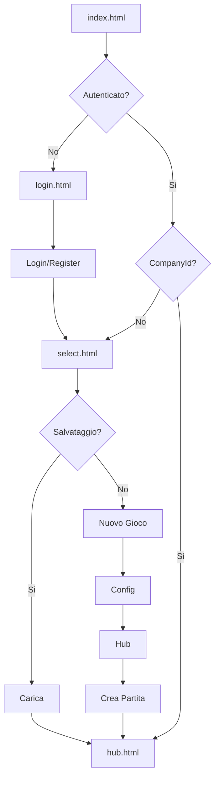
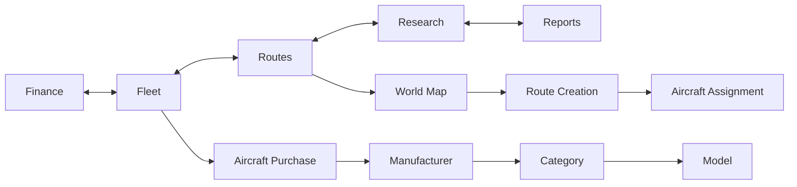

# Air Tycoon 2 - Mappa Funzionale delle Pagine

> Stato di implementazione di pagine, modali e sottosistemi. Coerente con
> `DEVELOPMENT_GUIDELINES.md` v2.0. Il *backlog* (cosa costruire dopo) vive su
> TickTick (lista "Air tycoon").
> Ultimo aggiornamento: 13 agosto 2026

## Indice
1. [Panoramica](#panoramica)
2. [Pagina Index (Launcher)](#index)
3. [Sistema Autenticazione](#auth)
4. [Selezione Gioco](#select)
5. [Hub Principale](#hub)
6. [Modali e Sottosistemi](#modali)
7. [Flusso Utente](#flusso)

---

## 🌍 Panoramica {#panoramica}

SPA modulare con routing client-side e caricamento dinamico.

```
index.html (Launcher)
├── auth/login.html (Autenticazione)
├── game/select.html (Selezione Gioco)
└── hub.html (Hub Principale)
    ├── Tab Finance / Fleet / Routes / Research / Reports
    └── World Map (integrato)
```

---

## 🚀 Pagina Index (Launcher) {#index}

**File**: `index.html` — entry point, decide il routing.

Flusso:
1. Carica `load-game.js`
2. Controlla `sessionStorage` per `companyId`
3. Autenticato + companyId valido → `hub.html`
4. Autenticato, no companyId → `select.html`
5. Non autenticato → `auth/login.html`

**File coinvolti**: `Client/src/load-game.js`, `Client/src/utils/AuthManager.js`

---

## 🔐 Sistema Autenticazione {#auth}

**File**: `auth/login.html`

- **Login**: `POST /api/auth/login` → redirect `select.html`
- **Registrazione**: `POST /api/auth/register` (password min 6 char)
- **UI**: animazioni nuvole/aeroplano, switch login↔register, loading overlay + toast
- **File**: `Client/src/auth.js`, `Client/styles/auth.css`, `Client/src/utils/AuthManager.js`

---

## 🎮 Selezione Gioco {#select}

**File**: `game/select.html` — **Stato: 🟡 Parzialmente implementato**

### Lista Salvataggi — ✅ Implementato
- `#saves-container`: partite utente, anteprima (nome, fondazione, budget, reputazione, n. aeromobili/rotte, hub)
- Azioni: Continua, Elimina (cestino in alto a destra)
- `GET /api/game/saves`

### Modal Nuovo Gioco — 🟡 Implementazione base
- Trigger: "Nuovo Gioco" / "Inizia Prima Partita" → `Client/pages/modals/new-game-modal.html`
- **Config base** ✅: nome compagnia (autosuggest), scenario (`aviation_dawn` 1950, `jet_age` 1970, `deregulation` 1990, `modern_era` 2024)
- **Hub partenza** 🟡: `populateStartingAirports()` via `GET /api/airports` + filtro client-side; drill-down continente→nazione→aeroporto; ordinamento per `business_level`; ❌ bandiere paesi
- Da fare: UI raggruppamento geografico più user-friendly

### Modal Elimina Salvataggio — ✅ Implementato e corretto
- Trigger: icona cestino; template `Client/pages/modals/delete-modal.html`
- ID: `delete-modal`, `close-delete-modal`, `cancel-delete`, `confirm-delete`, `delete-save-name`
- `DELETE /api/game/companies/${companyId}` (corretto da `/saves` a `/companies`)
- Feedback: loading overlay + toast; logging debug per troubleshooting

**Bug fix completati**: ID uniformati al template; caricamento dinamico robusto; endpoint corretto; rimossi listener duplicati; percorso script `/src/` → `/main-src/`.

**File**: `Client/src/game-select.js`, `Client/styles/game-select.css`, `Client/pages/modals/new-game-modal.html`

---

## 🏢 Hub Principale (Gioco) {#hub}

**File**: `hub.html` — centro di controllo.

### Header
- Company info, game status (data, pausa/play, velocità), user menu (settings, logout, save)

### Tab
- **Finance** 🟡: bilancio, cash flow, prestiti, export; *report completo = task TickTick*
- **Fleet** ✅: lista aeromobili + acquisto drill-down 4 colonne (produttore→categoria→modello→dettagli), immagine da `/Client/assets/aircraft/{model}.jpg`
- **Routes** ✅: World Map (Leaflet) + 8 moduli `Route*Manager` (stato, pannelli, aeromobili, domanda, mercato, creazione, calcoli, eventi)
- **Research** ❌ (future): tech tree, R&D, unlocks
- **Reports** ❌ (future): KPI, competitive analysis, market share

### World Map (integrato)
- OpenStreetMap via Leaflet; marker aeroporti; linee rotte attive; click per dettagli; zoom/pan

**File**: `hub.html`, `Client/src/main.js`, `Client/src/ui/FleetTab.js`, `Client/src/ui/modules/Route*.js`, `Client/src/graphics/WorldMap.js`, `Client/styles/ui.css`

---

## 🎭 Modali e Sottosistemi {#modali}

- **Aircraft Purchase** (in-tab, Fleet): 4 colonne drill-down; preview immagini; calcolo capacità auto; compatibilità campo
- **Route Creation Panel** (sidebar): origine/dest, aeromobile, analisi domanda, costi, profittabilità
- **Settings Overlay**: audio/video, preferenze UI, logout, save manuale

---

## 🔄 Flusso Utente {#flusso}





---

## 📚 Convenzioni (da v2.0)
- Tutti i JS serviti da `/main-src` (NON `/src/`, che è BAN)
- Nessun `import`/`export` ES6 nel frontend → tutto su `window`
- Nessun `console.log` di debug in produzione
- Nessun fallback che maschera errori API (§no-fallback)
- Aggiungendo pagina/modale: HTML in `Client/pages/`, controller in `Client/src/pages/`, CSS in `Client/styles/`; documentare endpoint in `/server/openapi/`
